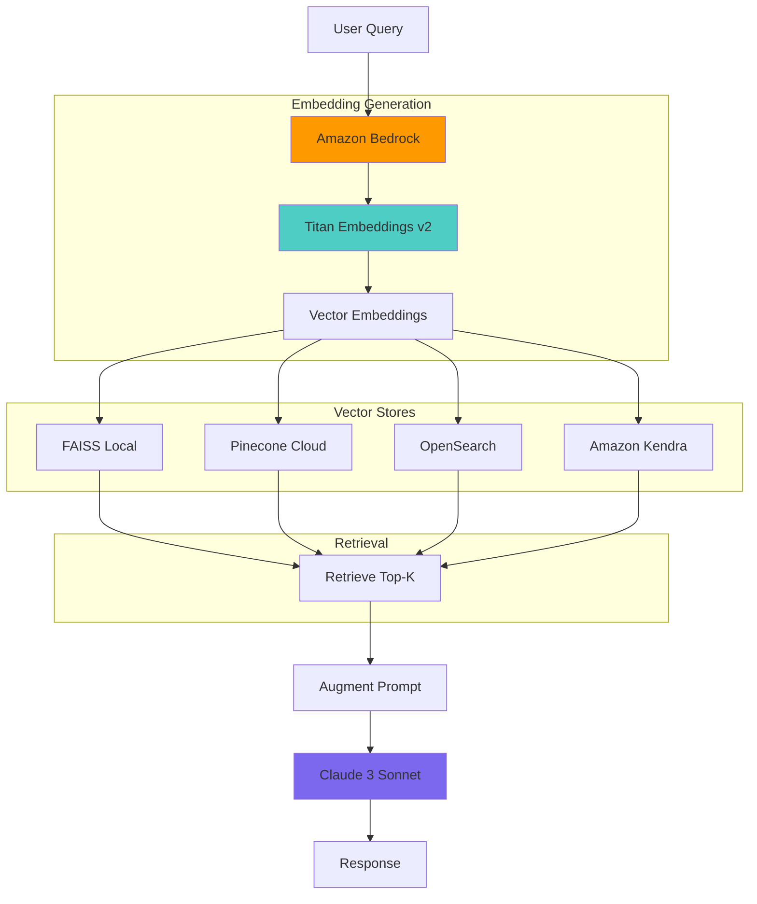
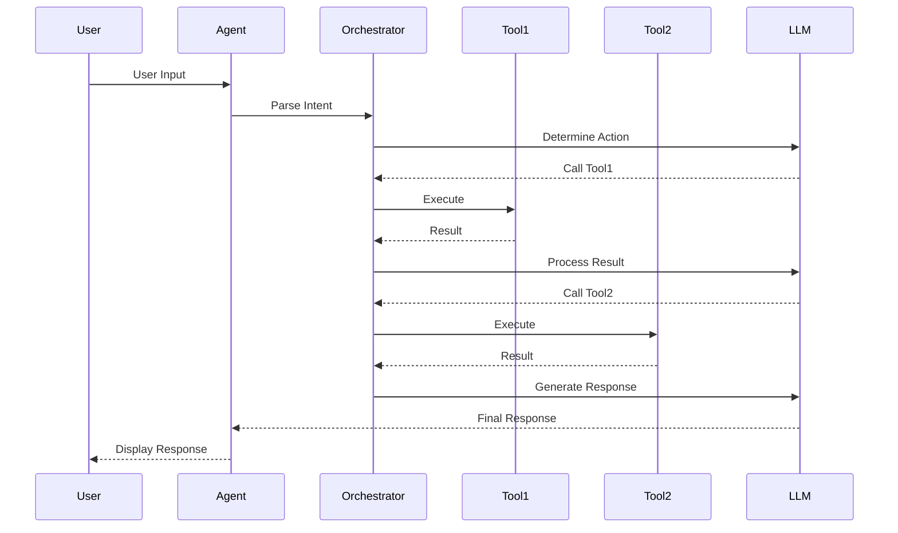
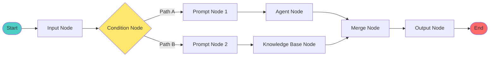
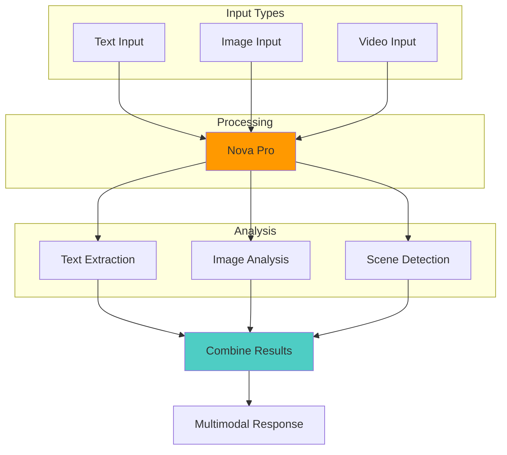
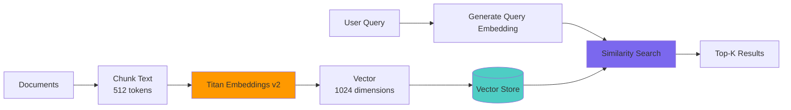
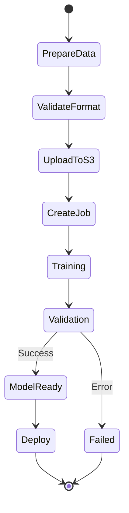
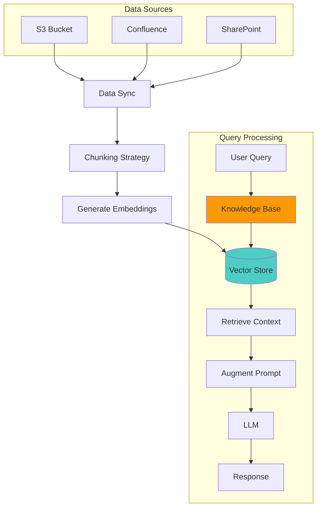
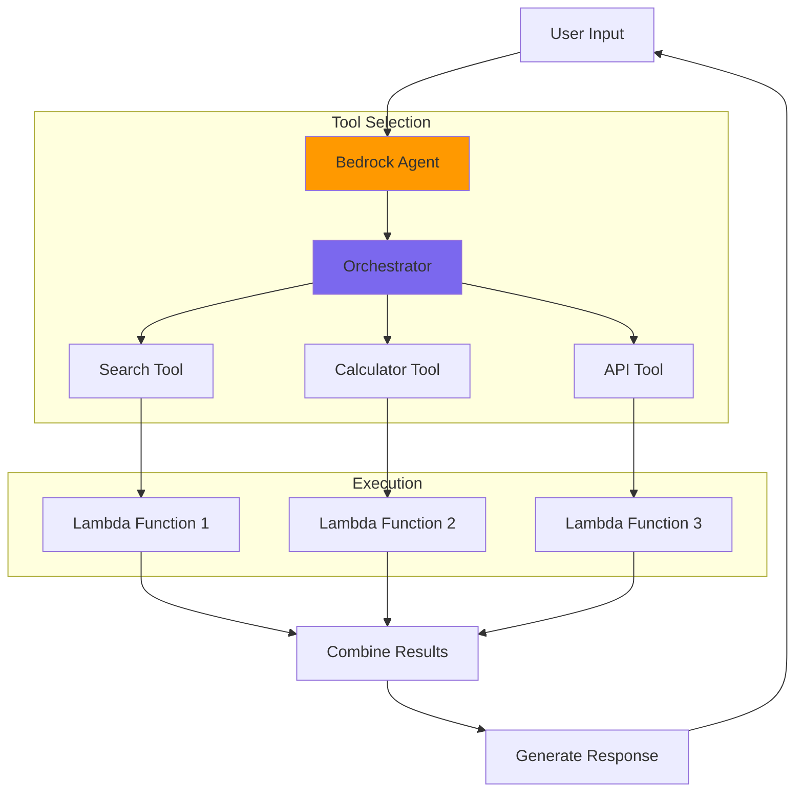
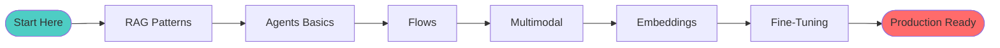

# Bedrock Foundations - Architecture Diagrams

---

## RAG Pattern Architecture

---

## Simple Agent Architecture

---

## Bedrock Flows Architecture

---

## Multimodal Processing

---

## Embeddings Pipeline

---

## Fine-Tuning Workflow

---

## Knowledge Base Integration

---

## Agent with Tools

---

## Complete Learning Path

---

**Last Updated**: 2026-03-09
